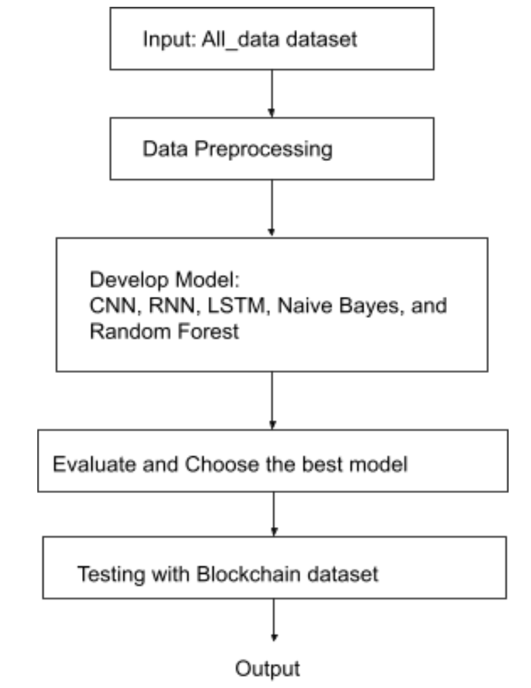
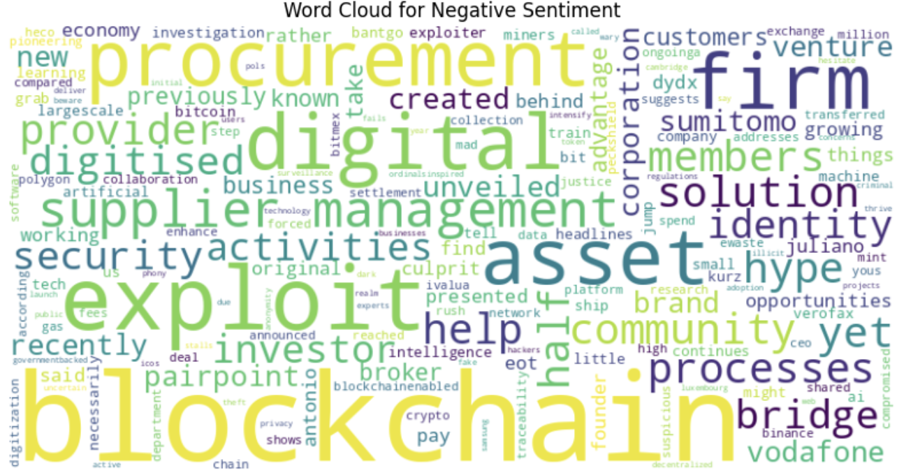

# Financial News Sentiment Analysis

Welcome to the Financial News Sentiment Analysis project! This repository contains the code and resources for performing sentiment analysis on financial and blockchain news data using various machine learning models.

## Table of Contents

- [Introduction](#introduction)
- [Features](#features)
- [Technologies Used](#technologies-used)
- [Data Sources](#data-sources)
- [Installation](#installation)
- [Setting Up](#setting-up)
- [Data Preparation](#data-preparation)
- [Modifying the File Path](#modifying-the-file-path)
- [Models and Evaluation](#models-and-evaluation)
- [Screenshots](#screenshots)
- [Summary](#summary)

## Introduction

The goal of this project is to apply Natural Language Processing (NLP) techniques for sentiment analysis on financial and blockchain news data to derive insights that could influence decision-making and strategy development in these sectors.

## Features

- Data preprocessing (text cleaning, normalization, tokenization, and vectorization)
- Sentiment analysis using multiple machine learning models (Naive Bayes, Random Forest, CNN, RNN, LSTM)
- Model training and evaluation
- Visualization of results using word clouds

## Technologies Used

- Python
- Pandas and NumPy for data manipulation
- NLTK for text preprocessing
- Scikit-learn for traditional machine learning models
- TensorFlow and Keras for deep learning models

## Data Sources

- Financial news dataset from Kaggle: Contains general financial news stories labeled as “neutral,” “negative,” or “positive”
- Blockchain news dataset: Focuses on news related to blockchain technology

## Installation

1.	Clone the repository:
 
```
 git clone https://github.com/atharvaa27/NLP_FinancialNews_SentimentAnalysis.git
 cd NLP_FinancialNews_SentimentAnalysis
```
2.	Install the dependencies:
```
  pip install -r requirements.txt
```

## Setting Up
  
  1. Download or Clone the Project:
     - You can either download the .ipynb file or clone this repository to your local machine.
  
  2. Open in Google Colab:
     - Open the downloaded or cloned .ipynb file in Google Colab for an interactive environment.

## Data Preparation
  
  1. Download the Datasets:
     - Download the all_data.csv and Blockchain.csv files from the datasets folder in the repository.
     
  2. Upload the Datasets:
     - In Google Colab, go to the folder section on the left-hand side and upload both datasets.
    

## Modifying the File Path
  
  1. Copy the File Path:
     - Copy the file path of the all_data.csv file after uploading it in Colab.
  
  2. Edit the Notebook:
     - In the "Importing dataset for analysis" cell, replace the existing file path with the copied path for all_data.csv.

## Running the Notebook
  
  1. Execute the Cells:
     - You can now execute each cell sequentially to get the required output.

## Evaluation
  
  1. Update the Path:
     - Similarly, ensure that the Blockchain.csv file is appropriately referenced in the cell after the evaluation section.
    
## Models and Evaluation

The project uses various machine learning models for sentiment analysis:
1.	Naive Bayes
2.	Random Forest
3.	Convolutional Neural Network (CNN)
4.	Recurrent Neural Network (RNN)
5.	Long Short-Term Memory (LSTM)

## Evaluation Metrics

-	Accuracy
-	Precision
-	Recall
-	F1-Score

## Model Performance

| Model | Accuracy | Precision | Recall | F1-Score |
| ---   | ---      |---        | ---    | ---      |
|Naive Bayes|87.40%|88%        |88%     | 87%      |
|Random Forest|92.18%|92%      | 92%    | 92%      |
|CNN    |91.56%    |89%        |91%     | 87%      |
|RNN    |91.93%    |91.95%     | 91.91% | 91.91%   |
|LSTM   |90.22%    |90.21%     | 90.22% | 90.22%   |

## Screenshots

### Sentiment Analysis Workflow


### Word Cloud for Positive Sentiment


### Word Cloud for Negative Sentiment


### Word Cloud for Neutral Sentiment


## Summary
This research effectively analysed the mood of financial and blockchain news stories,
giving information about market movements and investor perspectives. The research
indicated that the majority of financial news items are neutral, indicating a fair and
factual reporting approach. In contrast, blockchain-related headlines had a positive tone,
indicating excitement about the sector's prospects.
